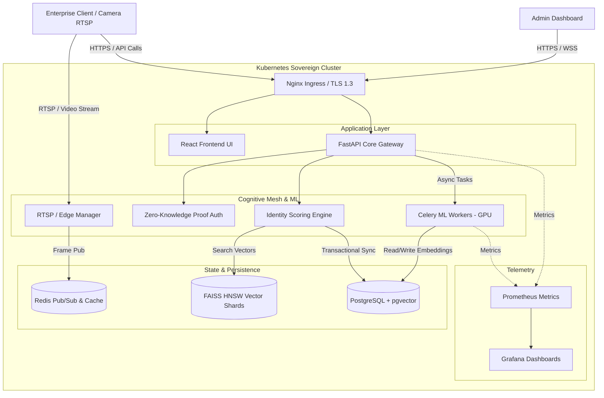

# LEVI-AI Architecture Diagram

This diagram illustrates the fully sovereign, air-gapped deployment architecture for LEVI-AI. All components reside within the enterprise's controlled Kubernetes environment.
